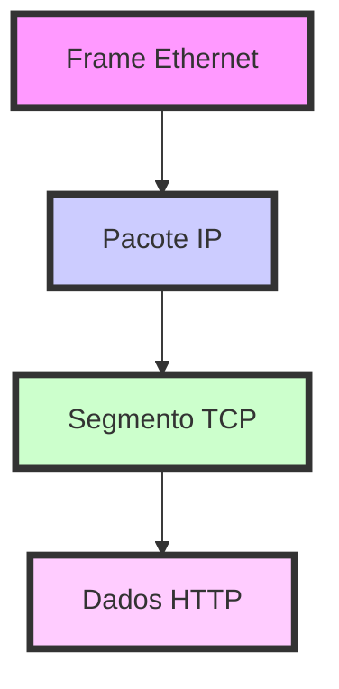

## Encapsulamento de Protocolos

A comunicação em redes é complexa e organizada em camadas, com dados encapsulados em protocolos específicos em cada etapa da transmissão. Aqui está um resumo do processo de encapsulamento, da camada de aplicação até a camada física:

### Frame Ethernet

```ad-info
title: Frame Ethernet icon: ethernet O Frame Ethernet é a unidade básica de transmissão na camada de enlace de dados. 

Ele contém o Header Ethernet, que inclui endereços MAC de origem e destino, e o Payload Ethernet, que carrega os dados da camada superior (normalmente, um Pacote IP).
```


### Pacote IP


```ad-info
title: Pacote IP icon: globe O Pacote IP transporta dados pela camada de rede. 

Seu Header IP inclui informações como endereços IP de origem e destino. O Payload IP é onde os dados das camadas superiores são carregados, como um Segmento TCP.
```

### Segmento TCP


```ad-info

Segmento TCP icon: arrows-split O Segmento TCP é responsável pela transmissão confiável de dados na camada de transporte. Contém o Header TCP, com portas de origem e destino, números de sequência e confirmação, e o Payload TCP, que pode transportar dados da camada de aplicação, como Dados HTTP.
```
`
### Dados HTTP

```ad-info

title: Dados HTTP icon: globe Os Dados HTTP são o conteúdo da camada de aplicação, encapsulado dentro do Payload TCP. 

Isso inclui as requisições e respostas HTTP que navegadores e servidores web trocam.
```


### Diagrama de Encapsulamento

Aqui está um exemplo de como o diagrama de encapsulamento poderia ser representado com Mermaid no Obsidian:





Este diagrama ilustra como cada camada de dados é encapsulada dentro da camada anterior, começando com os Dados HTTP, que são encapsulados dentro de um Segmento TCP, que por sua vez é encapsulado dentro de um Pacote IP, e finalmente, esse pacote é encapsulado dentro de um Frame Ethernet para transmissão.