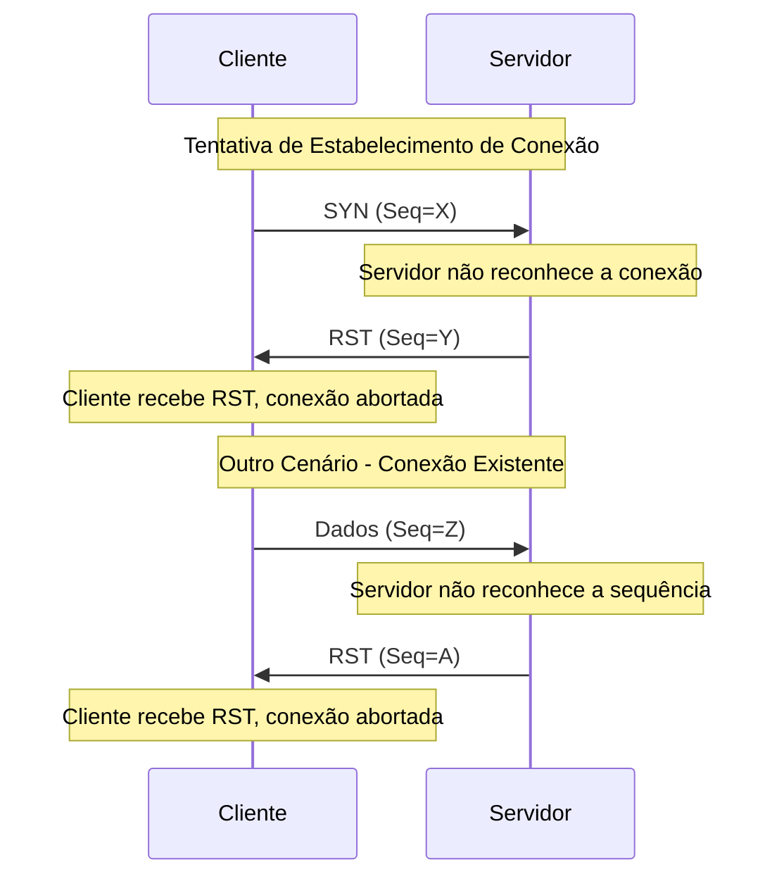

<h2 align="center">RST ACK</h2>

Quando ha algum problema no estabelecimento de uma conexao , a flag RST eh setada.

Pode ser por um problema como porta nao disponivel e entre outros..

Exemplos

Este diagrama ilustra dois cenários principais onde a flag RST pode ser utilizada:

1. **Tentativa de Estabelecimento de Conexão:**
    
    - O cliente tenta iniciar uma conexão enviando um segmento TCP com a flag SYN para o servidor.
    - O servidor, por algum motivo (e.g., a porta destino está fechada ou o servidor está configurado para recusar a conexão), responde com um segmento TCP contendo a flag RST, indicando que a conexão deve ser abortada.
    - O cliente recebe o RST e aborta o processo de conexão.
2. **Outro Cenário - Conexão Existente:**
    
    - O cliente envia dados dentro de uma conexão que acredita estar estabelecida.
    - Se o servidor não reconhecer a conexão (por exemplo, se a conexão foi fechada de seu lado, mas o cliente ainda tenta enviar dados), ele responderá com um RST.
    - Ao receber o RST, o cliente entende que a conexão foi abortada e deve parar de enviar dados.

A flag RST serve como uma forma eficaz de informar à outra parte que algo está errado, permitindo que a aplicação tome as medidas necessárias, seja tentando reconectar, seja tratando o erro de forma adequada.