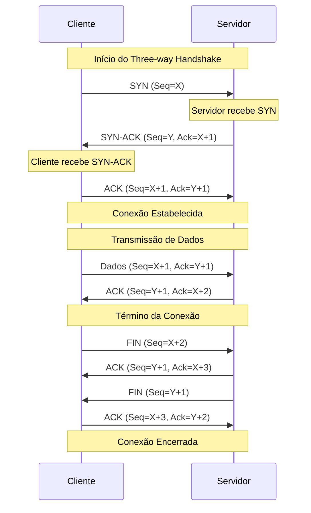

#estudos/tcp/básico

O Protocolo TCP é um protocolo confiável para transmissão de dados, pois ele garante a entrega das informações.

O TCP é orientado à conexão, o que significa que ele só transmite se garantir que uma conexão foi estabelecida com sucesso (Three-way Handshake).

## Características Principais do TCP

- **Confiável:** Garante a entrega de dados.
- **Orientado à conexão:** Requer um handshake antes de transmitir dados.
- **Controle de fluxo e congestionamento:** Regula a quantidade de dados enviados.

---

### Organograma - Estrutura de um Segmento TCP

Use um organograma para detalhar a estrutura de um segmento TCP, incluindo portas de origem e destino, número de sequência, flags, etc.

### Cards - Flags do TCP

Para cada flag do TCP (`SYN`, `ACK`, `PSH`, `RST`, `FIN`, `URG`), crie um card separado detalhando sua função.

### Tabela - Funções das Flags do TCP

Crie uma tabela para resumir as funções das principais flags do TCP:

| Flag | Função                                        |
|------|-----------------------------------------------|
| SYN  | Indica sincronizar, iniciar uma conexão.      |
| FIN  | Indica finalizar, a conexão deve ser fechada. |
| RST  | Indica resetar, usado quando ocorre um erro.  |
| PSH  | Indica que existem dados no payload TCP.      |
| ACK  | Confirmação do próximo número de sequência.   |
| URG  | Indica conteúdo urgente.                      |

---

<h3 align="center">Processo de conexao TCP com 3WH</h3>

